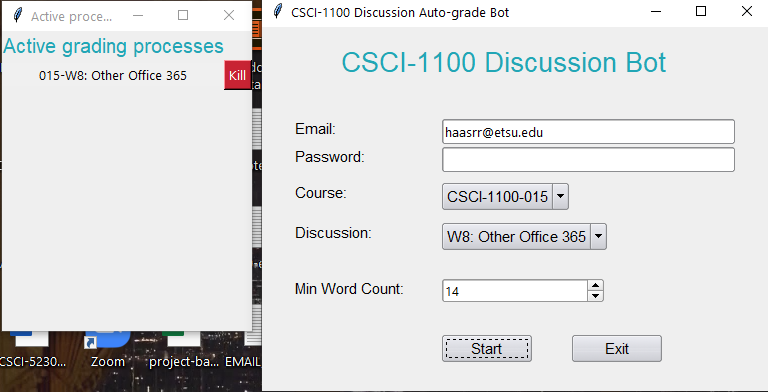
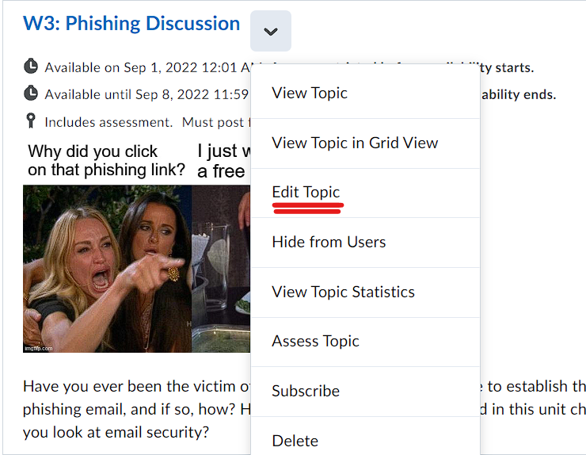
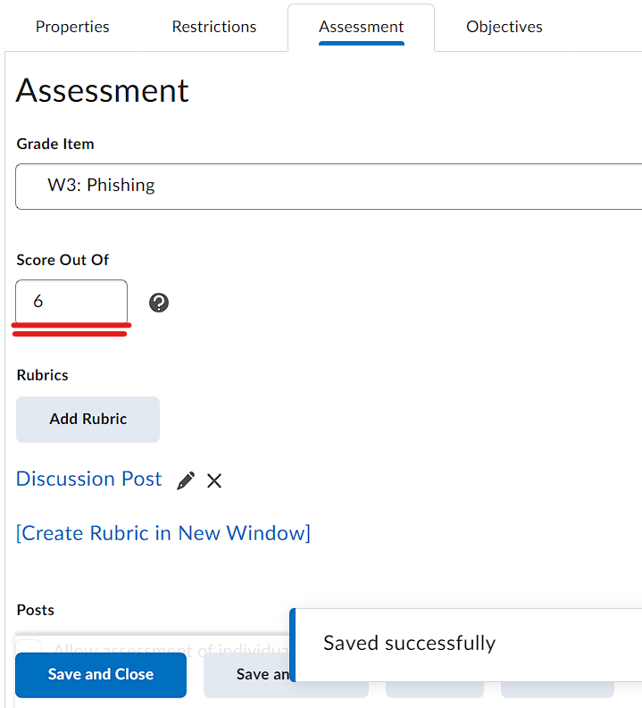
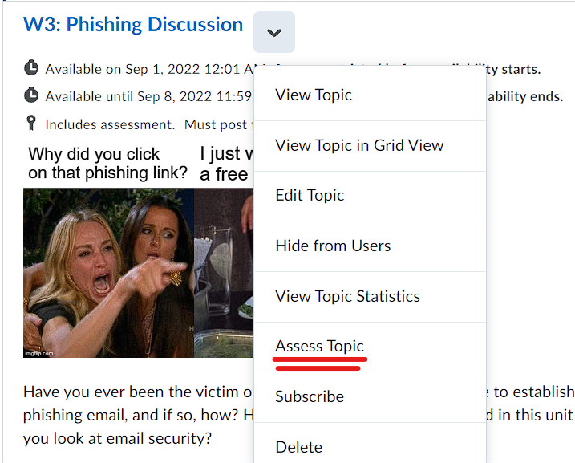
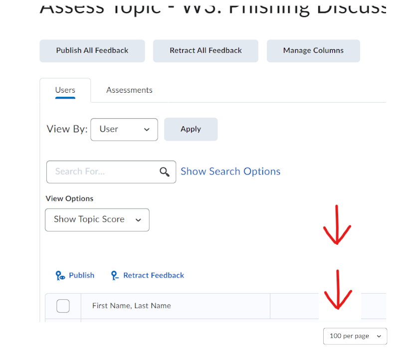

**************
discussionbot
**************

GUI + modularized 1100 discussion grading bot.

Python Setup
############

You will need to install Python. Install the latest stable release:

https://www.python.org/downloads/

D2L Setup
#########

Ensure Discussions set to Score out of 6
----------------------------------------

For each discussion you wish to grade, you will need to make sure it is scored out of 6.

1. Click the Discussion Topic's dropdown menu and click **Edit Topic**

2. Click the **Assessment** tab and type ``6`` in the "Score Out Of" field. Then click **Save and Close**.

Ensure the ``Assess Topic`` Screen is Set to Show **100 per page**
------------------------------------------------------------------

1. Click the Discussion Topic's dropdown menu and click **Assess Topic**

2. Scroll down to the bottom of the page and choose **100 per page** in the dropdown box. 

Code Setup
##########

Install dependencies
--------------------

Open Terminal (Mac) or PowerShell (Windows) to the main folder of this cloned repository and install
the requirements:

``pip install -r requirements.txt``

If that command does not work, try

``py -m pip install -r requirements.txt``

(You will have to use ``pip3`` on Mac and Linux)

Config
------

Open ``config.py``, enter your ETSU email address, replace the existing course names
with your course names, and modify the disucssions list to your liking.

Note that the program just looks for the beginning part of the name that is unique so
"W10", for example would find the right discussion in D2L. If you wrote "Week 10", however,
the program would not find that discussion in D2L.

.. code-block:: text

    THEME = 'dark' # set dark or light
    EMAIL = 'haasrr@etsu.edu' # your email here
    COURSES_LIST = [ # Change to your course names
        'CSCI-1100-0XX',
        'CSCI-1100-0XX',
        'CSCI-1100-9XX'
    ]
    # Full names not needed -- just enough of the start of name to be meaningful
    DISCUSSIONS_LIST = [
        # For convenience, just list the discussions you still need to grade
        'W9: PowerPoint',
        'W10: Powerpoint II',
        'W11: Excel',
        'W12: Unexpected Uses',
        'W13: Excel Shortcuts'
    ]

Execute
#######

GUI
---

Run ``py launch.py`` from the main project folder. You can run multiple windows
in parallel, but I would not run more than two at a time, depending on your computer's
specs.

GUI Shortcut (Windows)
----------------------

If you want to create a desktop shortcut on Windows, right click on your Desktop, then...

Choose ``New`` > ``Shortcut`` > ``Browse`` and browse the file path until you are in the
root project folder and select ``discussionbot.vbs``.

.. image::
    ./readme_images/windows-create-shortcut.gif
    :width: 650
    :alt: Create Windows shortcut gif

This is easier than running the program from a terminal although you don't get to see output
from Selenium **unless you change the 0 to 1 in** ``discussionbot.vbs``.

Command Line
------------

A command line script is also available and it features an optional debug setting
where you will press your *Enter* key between steps (simulating break points).

The command line script still reads its config from ``config.py`` so make sure
to personalize your config.

Execute the command line script:

``python cli.py``